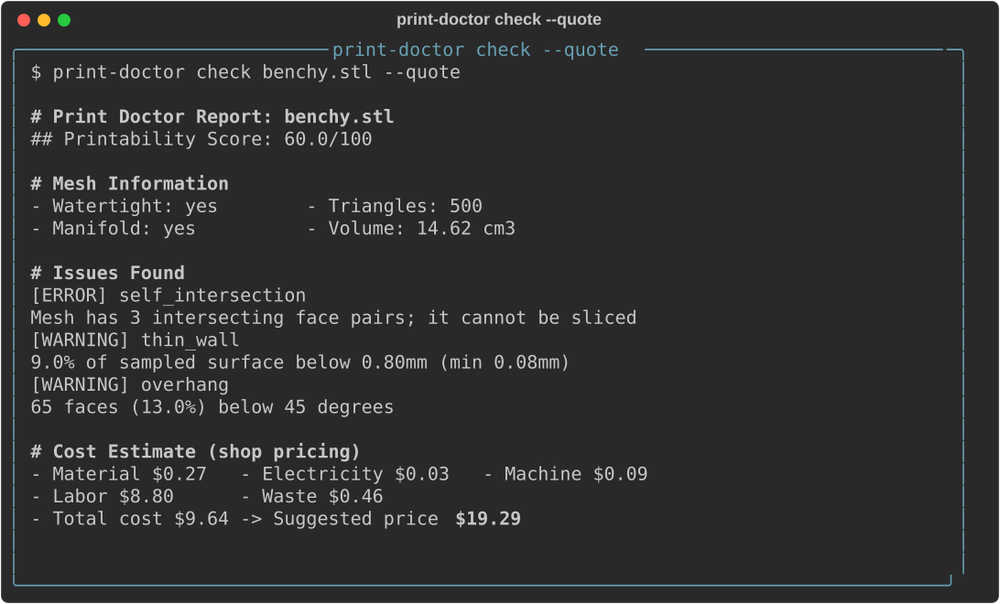
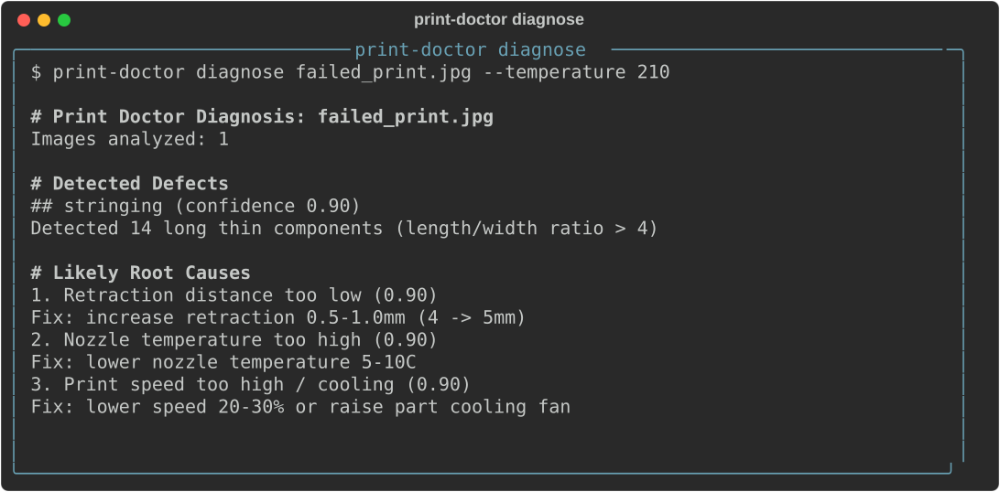
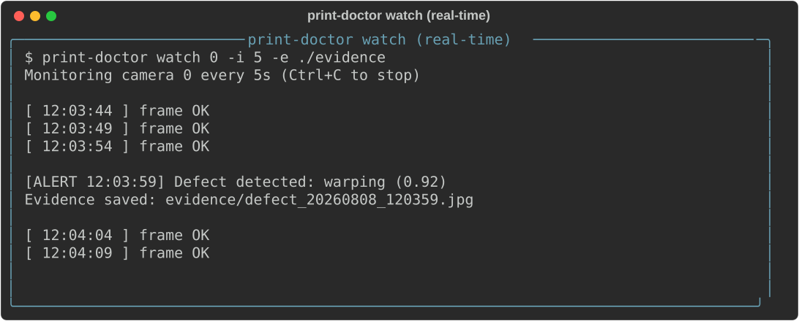

# 3DPrint Doctor

**The complete 3D printing assistant — check, quote, monitor, and diagnose.**

One CLI that covers a print's full lifecycle: pre-flight printability check and
cost quoting, real-time defect monitoring while printing, and photo-based defect
diagnosis after a failure.

## Three moments of a print

| Moment | Command | What it does |
|---|---|---|
| 🛠 **Before** | `print-doctor check` | 8 printability checks, 0-100 score, cost quote |
| 👁 **During** | `print-doctor watch` | real-time defect alerts (camera / webcam URL) |
| 🔍 **After** | `print-doctor diagnose` | ML photo diagnosis + root-cause fixes |

## Why you need it

- **Netfabb shut down.** There is no modern free replacement for printability
  pre-check — until now.
- **"Upload and print" fails.** Non-manifold meshes, thin walls, overhangs and
  holes waste hours of print time and filament.
- **Print shops quote by hand.** Slow, inconsistent estimates.
- **Failed prints stay a mystery.** Stringing? Warping? Z-band? Which knob to
  turn?

Print Doctor answers all three: **is this model printable? what does it cost?
what went wrong?**

## Quick install

```bash
pip install print-doctor

print-doctor check model.stl
print-doctor diagnose failed_print.jpg
print-doctor watch 0
```

Requires Python 3.11+. Diagnosis needs OpenCV: `pip install print-doctor[vision]`.

See [Quick Start](quickstart.md) for details.

## Showcase

| | |
|---|---|
| **Check & quote** | **Diagnose** |
|  |  |
| **Watch** | |
|  | |

## License

MIT License
